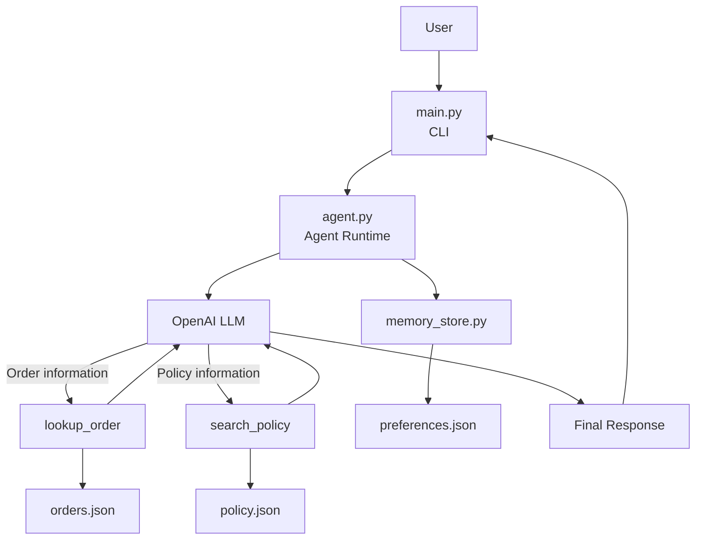

# 🛒 E-Commerce Support Agent

An AI-powered customer support agent for e-commerce that helps customers check orders, understand return/refund/replacement policies, and remember their preferred resolution.

The agent uses the OpenAI Responses API with tool calling to understand the user's request, decide when additional information is required, use the appropriate tools, and provide a final response.

---

## 📌 Business Problem

E-commerce customers often need support for questions such as:

- Where is my order?
- Can I return my order?
- How long does a refund take?
- Can I replace a damaged product?
- What should I do if my order cannot be found?

A traditional support system may require separate processes for checking order information and looking up company policies.

This project demonstrates a small AI-powered support agent that can understand the customer's request, decide which information it needs, use the available tools, and combine the results into a useful response.

---

## 🎯 Agent Goal

The goal of the agent is to provide simple e-commerce customer support by:

1. Understanding the customer's request.
2. Identifying whether order or policy information is required.
3. Selecting the appropriate tool.
4. Executing the selected tool.
5. Using the returned information to continue the decision process.
6. Using multiple tools when necessary.
7. Remembering useful customer information during and across conversations.
8. Handling failures without inventing information.
9. Providing a final response to the customer.

---

## 🤖 Why an Agent is Useful

This problem is suitable for an agentic approach because the agent does not simply send the user's message to an LLM and return the response.

The agent can make decisions about what action is required.

For example:

```text
User: Can I return ORD1001?
              ↓
        Agent / LLM
              ↓
       Need order details
              ↓
        lookup_order()
              ↓
        Order information
              ↓
       Need return policy
              ↓
        search_policy()
              ↓
         Policy result
              ↓
        Final response
```

The agent therefore combines **decision-making, tools, memory, and feedback from tool results** before completing the request.

---

## 🏗️ Architecture



### Main Components

| Component | Responsibility |
|---|---|
| `main.py` | CLI interface and session conversation history |
| `agent.py` | LLM interaction, tool selection, tool execution, memory integration, and agent loop |
| `tools.py` | Implements the business tools and provides their schemas to the LLM |
| `memory_store.py` | Saves and retrieves persistent customer preferences |
| `orders.json` | Local sample order data |
| `policy.json` | Local sample policy knowledge base |
| `preferences.json` | Persistent customer preference data |

---

## 🔄 Agent Workflow

The agent follows an iterative tool-calling process.

```text
User Request
     ↓
   Agent
     ↓
    LLM
     ↓
Tool Required?
   ↙       ↘
 No         Yes
 ↓           ↓
Answer    Select Tool
             ↓
        Execute Tool
             ↓
        Tool Result
             ↓
            LLM
             ↓
   More information needed?
        ↙           ↘
      Yes            No
       ↓              ↓
 Another Tool      Final Answer
       ↓
   Tool Result
       ↓
      LLM
```

The agent continues the loop until the LLM has enough information to produce a final response.

### Example of Multi-Tool Execution

For:

```text
Can I return ORD1001?
```

the agent can follow this flow:

```text
User Request
     ↓
lookup_order
     ↓
Order Details
     ↓
search_policy
     ↓
Return Policy
     ↓
Final Response
```

This demonstrates that the agent can use more than one tool for a single request.

---

## 🧰 Tools / Actions

The project provides two main business tools.

### 1. Order Lookup

**Function:**

```python
lookup_order(order_id)
```

Used when the customer asks about a specific order.

The tool can provide:

- Order ID
- Customer ID
- Product
- Amount
- Purchase date
- Order status
- Delivery date

Example:

```text
User: Where is my order ORD1001?
```

The LLM can select:

```text
lookup_order
```

The tool retrieves the information from `data/orders.json`.

---

### 2. Policy Search

**Function:**

```python
search_policy(query)
```

Used for questions related to store policies.

The policy knowledge base covers:

- Return window
- Refund process
- Replacement process
- Damaged or defective products
- Non-returnable items
- Return shipping

Example:

```text
User: How long do I have to return an item?
```

The LLM can select:

```text
search_policy
```

The tool searches `data/policy.json` and returns the relevant policy.

---

## 🧠 Memory / State

The project uses two types of memory.

### Session Memory

`main.py` maintains conversation history during the current session.

For example:

```text
User: My order is ORD1001.
Agent: ORD1001 is your Wireless Headphones order.

User: What is my order number?
Agent: Your order number is ORD1001.
```

The second request can use the previous conversation context.

---

### Persistent Memory

The agent also stores a customer's preferred resolution.

The preference is stored in:

```text
data/preferences.json
```

Example:

```json
{
  "user_001": {
    "preferred_resolution": "refund"
  }
}
```

If a customer says:

```text
I prefer a refund instead of a replacement.
```

the preference is saved.

The saved preference can then be retrieved in future requests and provided to the LLM as part of the customer context.

---

## 🛡️ Failure Handling

The agent is designed to avoid inventing order or policy information.

Tools return structured success or failure results.

### Unknown Order

```text
User: Where is my order ORD9999?

Tool selected: lookup_order

Tool result:
{
    "success": false,
    "error": "order_not_found"
}

Agent:
I couldn't find order ORD9999.
Please double-check the order ID and send it again.
```

The agent does not invent an order status when the order is not present in the data.

---

### Unknown Policy

```text
User: What is the policy for moon travel?

Tool selected: search_policy

Tool result:
{
    "success": false,
    "error": "policy_not_found"
}

Agent:
There's no store policy for moon travel.
I can help with returns, refunds, replacements,
or other available store policies.
```

---

## 🔍 Agent Trace

The application displays the important steps of the agent execution.

Example:

```text
User request: Where is my order ORD1001?

Tool selected: lookup_order

Tool input: {'order_id': 'ORD1001'}

Tool result:
{
    'success': True,
    'data': {
        'order_id': 'ORD1001',
        'product': 'Wireless Headphones',
        'status': 'delivered'
    }
}

Final response:
Order ORD1001 was delivered on August 30, 2026.
```

The trace helps demonstrate:

**User Request → Tool Selection → Tool Input → Tool Result → Final Response**

---

## 📁 Project Structure

```text
ecommerce-support-agent/
│
├── data/
│   ├── orders.json
│   ├── policy.json
│   └── preferences.json
│
├── tests/
│   └── test_agent.py
│
├── agent.py
├── tools.py
├── memory_store.py
├── main.py
├── requirements.txt
├── .env.example
├── .gitignore
└── README.md
```

### File Responsibilities

| File | Responsibility |
|---|---|
| `main.py` | CLI interface and session conversation history |
| `agent.py` | LLM interaction, tool selection, agent loop, and memory |
| `tools.py` | Order lookup, policy search, and tool schemas |
| `memory_store.py` | Persistent customer preference storage |
| `orders.json` | Sample customer orders |
| `policy.json` | Sample e-commerce policies |
| `preferences.json` | Saved customer preferences |
| `test_agent.py` | Automated tests |
| `requirements.txt` | Python dependencies |
| `.env.example` | Environment variable template |

---

## 💻 Sample Input / Output

### Order Lookup

```text
You: Where is my order ORD1001?

User request: Where is my order ORD1001?

Tool selected: lookup_order
Tool input: {'order_id': 'ORD1001'}

Tool result:
{'success': True, ...}

Final response:
Order ORD1001 was delivered on August 30, 2026.

Agent:
Order ORD1001 was delivered on August 30, 2026.
```

---

### Policy Search

```text
You: How long do I have to return an item?

Tool selected: search_policy

Tool input: {'query': 'return window'}

Tool result:
{'success': True, ...}

Agent:
Items can be returned within 15 days of the delivery date,
provided they are unused and in their original packaging.
```

---

### Multiple Tools

```text
You: Can I return ORD1001?

Tool selected: lookup_order
Tool input: {'order_id': 'ORD1001'}

Tool selected: search_policy
Tool input: {'query': 'return window'}

Agent:
ORD1001 was delivered on August 30, 2026.
It can be returned within 15 days of delivery,
provided it is unused and in its original packaging.
```

---

### No Tool Required

```text
You: Hello, what can you help me with?

Agent:
Hello! I can help you with checking orders,
return policies, refunds, replacements,
and related customer support questions.
```

No tool is required because the question can be answered directly.

---

## 🛠️ Technologies Used

- Python
- OpenAI Responses API
- LLM Tool Calling
- JSON
- python-dotenv
- Command Line Interface

---

## ⚙️ How to Run

### 1. Clone the repository

```bash
git clone https://github.com/Shrijitvivek/ecommerce-support-agent.git
cd ecommerce-support-agent
```

### 2. Create a virtual environment

```bash
python3 -m venv .venv
source .venv/bin/activate
```

### 3. Install dependencies

```bash
pip install -r requirements.txt
```

### 4. Configure the API key

Create the `.env` file:

```bash
cp .env.example .env
```

Add your OpenAI API key:

```text
OPENAI_API_KEY=your_api_key_here
```

Do not commit `.env` to GitHub.

### 5. Run the application

```bash
python main.py
```

The application will ask for a user ID and then allow the user to interact with the support agent.

Type:

```text
quit
```

or:

```text
exit
```

to end the session.

---

## 🧪 Testing

Run the test suite:

```bash
python -m pytest
```

A basic syntax check can also be performed using:

```bash
python -m py_compile agent.py memory_store.py
```

The project should be tested with different scenarios including:

- Valid order lookup
- Policy search
- Multiple tool calls
- No-tool questions
- Unknown order
- Unknown policy
- Persistent preference
- Multi-turn conversation

---

## 📊 Sample Data

The project uses synthetic local data for demonstration.

### `orders.json`

Contains sample orders with different statuses such as:

- Delivered
- Shipped
- Processing
- Cancelled

### `policy.json`

Contains sample policies covering:

- Return window
- Refund process
- Replacement process
- Non-returnable exceptions
- Damaged or defective items
- Return shipping cost

### `preferences.json`

Stores customer preferences such as:

```json
{
  "user_001": {
    "preferred_resolution": "refund"
  }
}
```

The project does not connect to a real e-commerce platform, payment system, shipping provider, or customer database.

---

## ⚠️ Limitations

This is a small prototype designed for learning and demonstration.

Current limitations include:

- Uses local JSON files instead of a real e-commerce database.
- Uses synthetic order and policy data.
- Does not connect to real payment or shipping systems.
- Policy search uses a simple local keyword-based search.
- Customer preferences are stored in a local JSON file.
- The application currently runs through a command-line interface.
- It is not designed as a production customer support system.
- Authentication and real customer account management are not implemented.

---

## 🚀 Future Improvements

Possible future improvements include:

- Connect the agent to a real order management system.
- Add more customer support tools.
- Add a proper database for orders and customer memory.
- Improve policy retrieval using semantic search or RAG.
- Add authentication and customer accounts.
- Add a web-based interface.
- Add human support escalation.
- Add more advanced conversation and memory management.
- Add monitoring and evaluation of agent responses.
- Explore frameworks such as LangGraph for more complex agent workflows.

---

## 🎯 Learning Objectives

This project demonstrates practical concepts in Agentic AI, including:

- LLM application development
- Agentic workflows
- Function/tool calling
- Tool schemas
- Agent loops
- Session memory
- Persistent memory
- Decision-making
- Failure handling
- Structured tool results
- Conversation context
- LLM-based tool selection

---

